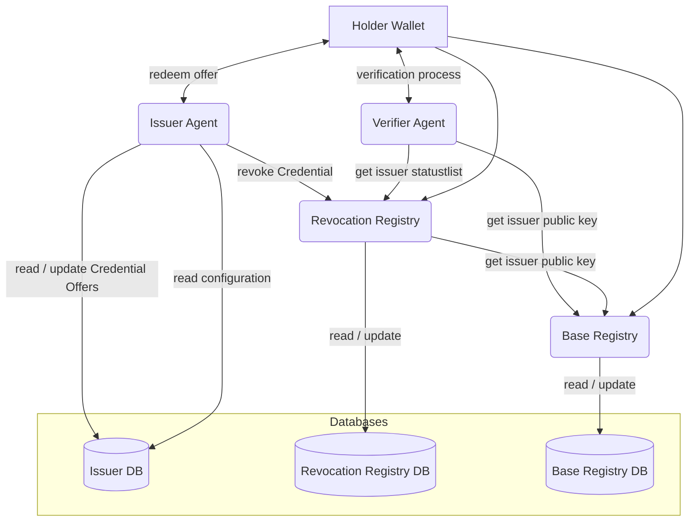
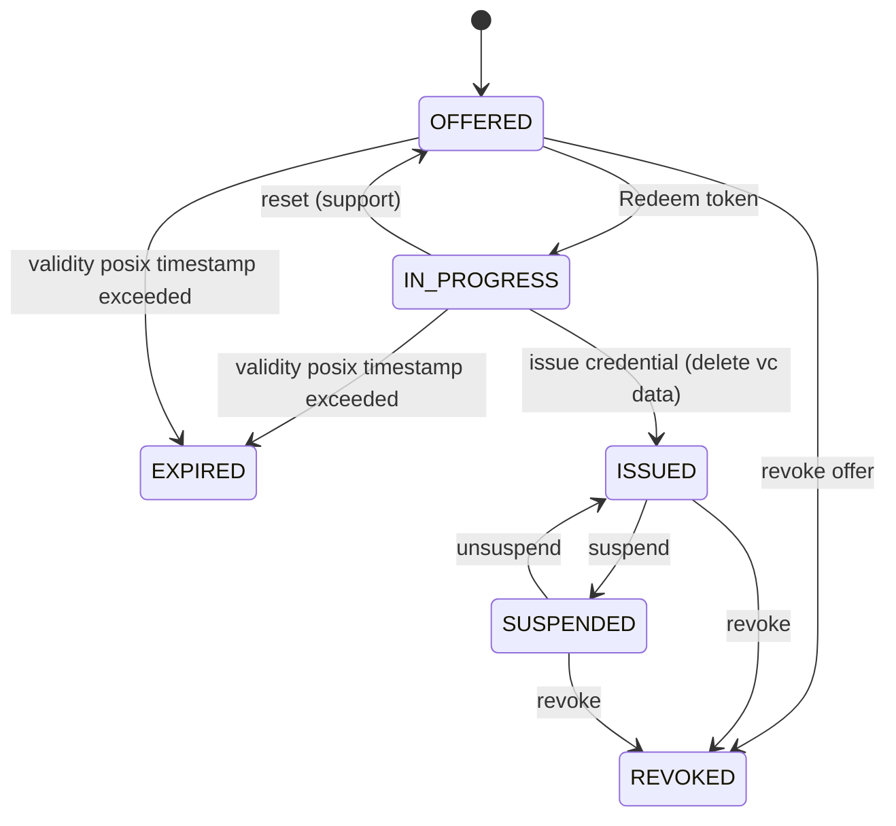

<!--
SPDX-FileCopyrightText: 2024 Swiss Confederation

SPDX-License-Identifier: MIT
-->

# OpenID4VC Proof of Concept

> [!NOTE]
> Please be aware that this repository serves as example and not as reference code

This proof of concept serves as a SSI-Showcase with OID4VC with a small set of features (as an MVP) for Verifiable Credentials with SD-JWT as authentication mechanism between issuers & base registry to gain insights about the technologies. After that initial phase of learning the product will be gradually expanded. The main objective is to verify assumptions, gain knowledge and experience with the product and its acceptance within the target audience.

## Table of Contents

- [Project Context](#project-context)
- [System Overview](#system-overview)
- [Project Setup](#project-setup)
- [Implementation details](#implementation-details)
- [Contribution](#contribution)
- [License](#license)

## Project Context

6.5 million people in Switzerland have a driving licence and 600'000 licences are being issued each year. asa (Association des services des automobiles/Vereinigung der Strassenverkehrsämter) wants to introduce a digital driving licence and digital vehicle registration documents in the future.

In a first step [asa](https://asa.ch/) onboards a small group of drivers - the learning drivers - in Appenzell Ausserrhoden. As soon as this group passes the theoretical exam, they will get a digital proof called eLFA (*e*lektronischer *L*ern*F*ahr*A*usweis). With this digital driving licence, they are allowed to drive a car accompanied by another driver. This proof is stored in a mobile application (wallet, link to [Android](https://github.com/e-id-admin/eidch-pilot-android-wallet) and [iOS Repo](https://github.com/e-id-admin/eidch-pilot-ios-wallet)). The police and driving instructors are trained to be able to verify the digital driving licence.

The E-ID Program is setup due to new [regulation for electronic identity](https://www.fedlex.admin.ch/eli/fga/2023/2843/de). In order to develop a trust infrastructure based on new technologies, several pilots have been launched - one of which is the eLFA.


## System Overview

Issuers are identified / authenticated according to the private / public key they hold. Updates to the registry are done using Verifiable Credentials.

Revocation registry is split off from base registry, to allow different optimizations.

In this case, should the identification and authorization of the issuer to update the revocation registry continue to be done using the existing public / private key as for signing JWTs.

### Components and interactions



Component details:

- [Admin Service](/admin/README.md) 
- [Base Registry](/registry_base/README.md)
- [Issuer](/issuer/README.md)
- [Revocation Registry](/registry_revocation/README.md)
- [Verifier](/verifier/README.md)
- [Wallet](/wallet/README.md)


## Project Setup

> [!NOTE]
> The package requirements and instructions written below are **ubuntu specific** and were tested in WSL. In other distributions the packages and installations can be different.

### Prerequisites to start environment (not suitable for development)

In order to start the environment install:

- docker >= 24.0.7
- python >= 3.11.7
- python3.11-venv
- libpq-dev
- jq

**Installation**

To install python 3.11 and docker please follow the instructions on the respective pages.

``` bash
sudo apt install jq libpq-dev python3.11-venv -y
```

### Prerequisites for development

In order to start the environment install:

- docker >= 24.0.7
- python >= 3.11.7
- python3.11-dev
- python3.11-venv
- libpq-dev
- jq
- build-essential

**Installation**

To install python 3.11 and docker please follow the instructions on the respective pages.

``` bash
sudo apt install jq build-essential libpq-dev python3.11-dev python3.11-venv -y
```

### Setup and Start environment

> [!IMPORTANT]
> The setup script needs to be run as a non-root user. Check whether the current user is actually in the docker group, to run docker as a non-root user

**Check docker group assignment**   
The setup script needs to be run as a non-root user. Check wether the current user is actually in the docker group, to run docker as a non-root user
```bash
> $ groups
<group 1> <group 2> docker
```

### Setup environment
To initially setup the environment, there is the follwing convenience script. Be aware that the initial run might **take up to 5 minutes**
````bash
bash setup_environment.sh
````
When the run was successfull the output should look like this:

```bash
 => [verifier run  9/12] COPY ./verifier/ verifier                                                                                                   0.8s
 => [verifier run 10/12] COPY ./common/ common/                                                                                                      0.4s
 => [verifier run 11/12] COPY ./verifier/main.py main.py                                                                                             0.3s
 => [verifier run 12/12] RUN addgroup -S APPGROUP && adduser -S APPUSER -G APPGROUP                                                                  0.9s
 => [verifier] exporting to image                                                                                                                    0.5s
 => => exporting layers                                                                                                                              0.4s
 => => writing image sha256:821dde7edffcee51c28d63379b5c797c4f3af7424d03b9fa7dd65a1215ade700                                                         0.0s
 => => naming to docker.io/library/ssi_openid-poc-verifier                                                                                           0.0s
done
###########################
Starting Admin Containers
Starting Base Registry Services
WARN[0000] The "ISSUER_ID" variable is not set. Defaulting to a blank string. 
WARN[0000] The "STATUS_LIST_CONFIG" variable is not set. Defaulting to a blank string. 
WARN[0000] a network with name oid4vc_local_dev exists but was not created for project "ssi_openid-poc".
Set `external: true` to use an existing network 
[+] Running 5/5
 ✔ Container ssi_openid-poc-db_revocation-1        Healthy                                                                                           0.6s 
 ✔ Container ssi_openid-poc-db_base-1              Healthy                                                                                           0.6s 
 ✔ Container ssi_openid-poc-registry_base-1        Started                                                                                           0.3s 
 ✔ Container ssi_openid-poc-registry_revocation-1  Started                                                                                           0.3s 
 ✔ Container ssi_openid-poc-admin-1                Started                                                                                           0.3s 
Waiting for startup to be complete
..........Done waiting. Ready or not here I come!
###########################
Onboarding the dev issuer
Registering Public Key at Registry
  % Total    % Received % Xferd  Average Speed   Time    Time     Time  Current
                                 Dload  Upload   Total   Spent    Left  Speed
100  1469  100   658  100   811   1173   1446 --:--:-- --:--:-- --:--:--  2637
New Issuer ID is 3d538856-3739-4099-a308-56178eb7cd46
Creating Status Lists
  % Total    % Received % Xferd  Average Speed   Time    Time     Time  Current
                                 Dload  Upload   Total   Spent    Left  Speed
100   195  100   195    0     0   1353      0 --:--:-- --:--:-- --:--:--  1363
  % Total    % Received % Xferd  Average Speed   Time    Time     Time  Current
                                 Dload  Upload   Total   Spent    Left  Speed
100   195  100   195    0     0   3125      0 --:--:-- --:--:-- --:--:--  3145
###########################
Configuring Issuer
Start systems to configure issuer...
WARN[0000] a network with name oid4vc_local_dev exists but was not created for project "ssi_openid-poc".
Set `external: true` to use an existing network 
[+] Running 9/9
 ✔ Container ssi_openid-poc-db_issuer-1            Healthy                                                                                           1.1s 
 ✔ Container ssi_openid-poc-db_base-1              Healthy                                                                                           0.0s 
 ✔ Container ssi_openid-poc-registry_base-1        Running                                                                                           0.0s 
 ✔ Container ssi_openid-poc-wallet-1               Started                                                                                           1.1s 
 ✔ Container ssi_openid-poc-db_revocation-1        Healthy                                                                                           0.0s 
 ✔ Container ssi_openid-poc-registry_revocation-1  Running                                                                                           0.0s 
 ✔ Container ssi_openid-poc-verifier-1             Started                                                                                           1.1s 
 ✔ Container ssi_openid-poc-admin-1                Running                                                                                           0.0s 
 ✔ Container ssi_openid-poc-issuer-1               Started                                                                                           0.3s 
..........Configure wallet for container use ...
done
Configure status list of issuer...
  % Total    % Received % Xferd  Average Speed   Time    Time     Time  Current
                                 Dload  Upload   Total   Spent    Left  Speed
100     4  100     4    0     0      2      0  0:00:02  0:00:01  0:00:01     2
done
###########################
Creating pytest.ini
###########################
All Done!
```

```bash
> $ docker container ls
CONTAINER ID   IMAGE                                COMMAND                  CREATED       STATUS                 PORTS                                               NAMES
e212ae97477f   ssi_openid-poc-verifier              "/app/.venv/bin/uvic…"   5 hours ago   Up 5 hours             8080/tcp, 0.0.0.0:8001->443/tcp, :::8001->443/tcp   ssi_openid-poc-verifier-1
9425c560e470   ssi_openid-poc-registry_base         "/app/.venv/bin/uvic…"   5 hours ago   Up 5 hours             8080/tcp, 0.0.0.0:8010->443/tcp, :::8010->443/tcp   ssi_openid-poc-registry_base-1
1c7c744122c4   ssi_openid-poc-admin                 "/app/.venv/bin/uvic…"   5 hours ago   Up 5 hours             8080/tcp, 0.0.0.0:1337->443/tcp, :::1337->443/tcp   ssi_openid-poc-admin-1
5be7e9c1900b   ssi_openid-poc-issuer                "/app/.venv/bin/uvic…"   5 hours ago   Up 5 hours             8080/tcp, 0.0.0.0:8000->443/tcp, :::8000->443/tcp   ssi_openid-poc-issuer-1
70e711fc0a57   ssi_openid-poc-registry_revocation   "/app/.venv/bin/uvic…"   5 hours ago   Up 5 hours             8080/tcp, 0.0.0.0:8011->443/tcp, :::8011->443/tcp   ssi_openid-poc-registry_revocation-1
de36d9107367   postgres                             "docker-entrypoint.s…"   5 hours ago   Up 5 hours (healthy)   0.0.0.0:5434->5432/tcp, :::5434->5432/tcp           ssi_openid-poc-db_issuer-1
78e831aa0e3b   ssi_openid-poc-wallet                "/app/.venv/bin/uvic…"   5 hours ago   Up 5 hours             0.0.0.0:443->443/tcp, :::443->443/tcp, 8080/tcp     ssi_openid-poc-wallet-1
238b822d3817   postgres                             "docker-entrypoint.s…"   5 hours ago   Up 5 hours (healthy)   0.0.0.0:5435->5432/tcp, :::5435->5432/tcp           ssi_openid-poc-db_base-1
c6f2e5888c61   postgres                             "docker-entrypoint.s…"   5 hours ago   Up 5 hours (healthy)   0.0.0.0:5433->5432/tcp, :::5433->5432/tcp           ssi_openid-poc-db_revocation-1
```
Now that the python venv has been built, you have to activate it
```bash
source .venv/bin/activate
```

### How to use in local development mode

If you have already run the setup_environment.sh script then start at point 3 or 2 if you have stopped the containers for example with docker compose down.

1. execute setup_environment.sh
    * This performs the onboarding in your docker compose environment
2. docker compose up 
3. navigate to https://localhost:8000/docs for issuer
3. check /health/ for problems
    * metadata needs to be set via /oid4vc/admin/metadata 
    * first time status list must be initialized by issuer with /admin/status-list


### While coding
When there is an incoming change, you might need to reset the environment based on the severity of the changes

### Rebuild the containers
``` bash
docker compose build
```
or
``` bash
docker compose build --no-cache
```
### Reset the environment
Changes affecting cryptographical parts might require to delete additional generated folders. This can be achieved by running the following convenience script
```bash
bash reset_environment.sh
```

## Implementation details

### Credential Status
Credentials are tracked using a management id. Together with the management id, a state is provided. This diagram shows an overview of the states and the possible transitions.



### Logging

Logs are sent to stdout using the logging module provided by python.

The log level can be set using an environment variable "LOG_LEVEL". To identify the application, the environment variable "APP_NAME" needs to be set.

### Database Versioning
Database Versioning is done with Alembic.
To create a new version use the command `alembic revision`
eg:
```alembic revision -m "<comment>" --rev-id <major>.<minor>```

## Contribution

We appreciate feedback and contribution. More information can be found in the [CONTRIBUTING-File](/CONTRIBUTING.md).

## License
This project is licensed under the terms of the MIT license. See the [LICENSE](/LICENSE) file for details.