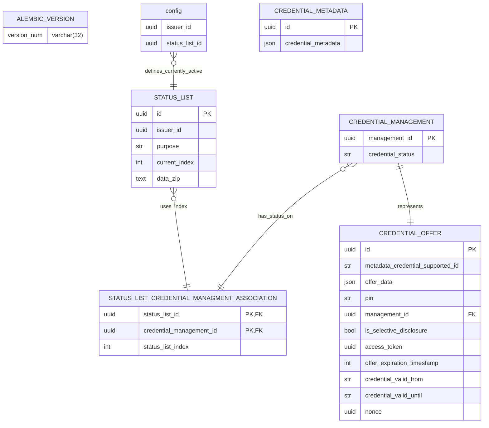

<!--
SPDX-FileCopyrightText: 2024 Swiss Confederation

SPDX-License-Identifier: MIT
-->

# Issuer

The issuer is responsible for creating and issuing a verifiable credential. It asserts claims about a subject and includes the information in the verifiable credential (vc). The issuer is a trusted entity that has the necessary infrastructure to issue, manage and revoke verifiable credentials.

## Implementation details

Used version for flow and vc-data model can be found here:
- [Issuance flow](https://openid.net/specs/openid-4-verifiable-credential-issuance-1_0-12.html)
- [VC-Data model](https://www.w3.org/TR/2022/REC-vc-data-model-20220303/)

## Non-Standard Features
* The Issuer creates JWT or SD-JWT according to the openid4vc credential id in the .well-known/openid-credential-issuer metadata. If the id starts with "sd_" an sd_jwt is created. Else a regular jwt is used.
* Currently the issuer only supports the [pre-authenticated flow](https://openid.bitbucket.io/connect/openid-4-verifiable-credential-issuance-1_0.html#name-pre-authorized-code-flow)
* On startup for the development environment the issuer attempt to register itself at the registry. This should not be possible in a non-dev environment.
* In addition the issuer also offers some static html files store_redirect.html to redirect the user to the store on his mobile phone and also store_redirect.html for an offer deeplink.

### Keys
The isuer can use a set of public / private keys for signing verifiable credentials or use keys from a HSM using PKCS11.

### Environment Variables
| Variable                | Description                                                                                                                                    |
| ----------------------- | ---------------------------------------------------------------------------------------------------------------------------------------------- |
| ENABLE_DEBUG_MODE       | Enables a set of settings which should be used in development mode. Default is False; Values: True/False;                                                       |
| ENABLE_SSL_VERIFICATION | Enables the cert valiidation in TLS requests to other systems Default is True; Values: True/False;                                                             |
| ENABLE_SPLUNK_LOG       | Enable Splunk compatible log format. Default is False, but True in DEBUG_MODE; Values: True/False;                                                             |
| REGISTRY_BASE_URL       | URL to access registry; for local dev environment that would be: https://registry_base/issuer                                                  |
| REGISTRY_BASE_API_KEY       | API Key to access registry; for local dev environment that would be whatever in docker compose is defined for base registry                    |
| REGISTRY_REVOCATION_URL | URL to access registry; for local dev environment that would be: https://registry_revocation/issuer                                            |
| REGISTRY_REVOCATION_API_KEY | API Key to access registry; for local dev environment that would be whatever in docker compose is defined for base registry                    |
| EXTERNAL_URL            | URL how holder devices can access the issuer for redeeming credential offers, etc                                                              |
| SIGNING_KEY_PUBLIC      | Public key as a string, as it would be read by `cat public_key.pem`                                                                            |
| SIGNING_KEY_PRIVATE     | Private key as a string, as it would be read by `cat private_key.pem`                                                                          |
| SIGNING_ALGORITHM       | Algorithm used for singing, needs to be [compatible](https://learn.microsoft.com/en-us/azure/key-vault/keys/about-keys-details) with they keys |
| ISSUER_ID               | The id the issuer (with matching public key) has on the base registry                                                                          |
| STATUS_LIST_ID          | The id of the statuslist (assigned to the issuer id) to be used by the issuer with the revocation registry                                     |
| APP_NAME | Identifier added to the different log entries |
| LOG_LEVEL | Log levels according to [logging library](https://docs.python.org/3/library/logging.html#levels) |
| ADDITIONAL_ALLOWED_ORIGINS | Comma separated list of url (e.g. URL,URL,URL) which should be send in CORs allowed origins param |

#### HSM
Instead of mounting certs, it's also possible to define HSM connection as environment variables
| Variable  | Description  |
|---|---|
| SOFTHSM2_CONF | Softhsm Configuration File location, pointing towards the SoftHSM2 created files; Should only be used for dev |
| HSM_LIBRARY | Posix Path of the HSM Library |
| HSM_TOKEN | String of the HSM Token Label |
| HSM_PIN | Pin for the HSM Token Label |
| HSM_LABEL | Label for the Key in the HSM Token |
| HSM_SIGNING_ALGORITHM | Signing algorithm to be used with the key |

#### Template
For some cases the issuer agent has to deliver single page html files from templates.
| Variable  | Description  |
|---|---|
| TEMPLATE_BASE_DIR | Base Directory for all templates, defaults to "res/template" |
| TEMPLATE_REDIRECT_STORE | Jinja Template for the redirect page, defaults to "store_redirect.html" |
| TEMPLATE_REDIRECT_OFFER | Jinja Template for the redirect page, defaults to "offer_link_redirect.html" |

### ER Diagrams

- config is not a real table, it's provided by environment parameters.
- status_list_id in CONFIG table is the current used statuslist.