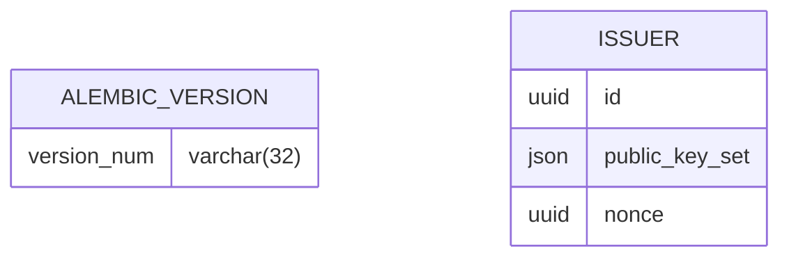

<!--
SPDX-FileCopyrightText: 2024 Swiss Confederation

SPDX-License-Identifier: MIT
-->

# Base Registry

The Base Registry is used to store Public Key Sets of ecosystem participants like Issuers. Accessing the public key from the Base Registry instead of /.well-known/jwks.json of the issuer prevents the tracking of uses of the public key by the key owner.

## Implementation details

### Environment Variables
| Variable                | Description                                                                                                                                    |
| ----------------------- | ---------------------------------------------------------------------------------------------------------------------------------------------- |
| USE_HTTPS               | Enables the use of https in all base registry links                                                                                            |
| ENABLE_DEBUG_MODE       | Enables the debug mode                                                                                                                         |
| DB_CONNECTION           | Connection string for the database                                                                                                             |
| APP_NAME                | Identifier added to the different log entries                                                                                                  |
| LOG_LEVEL               | Log levels according to [logging library](https://docs.python.org/3/library/logging.html#levels)                                               |
| ADDITIONAL_ALLOWED_ORIGINS | Comma separated list of url (e.g. URL,URL,URL) which should be send in CORs allowed origins param |

### ER Diagrams
