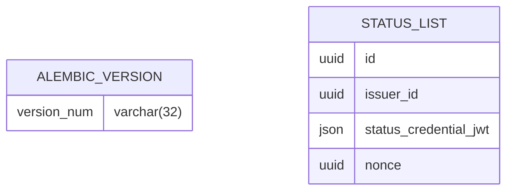

<!--
SPDX-FileCopyrightText: 2024 Swiss Confederation

SPDX-License-Identifier: MIT
-->

# Revocation Registry

The revocation registry manages lists of suspended and revoked credentials in the form of [status list credentials](https://www.w3.org/TR/vc-bitstring-status-list/) . The issuer service can write to this service.

## Implementation details

### ER Diagrams
