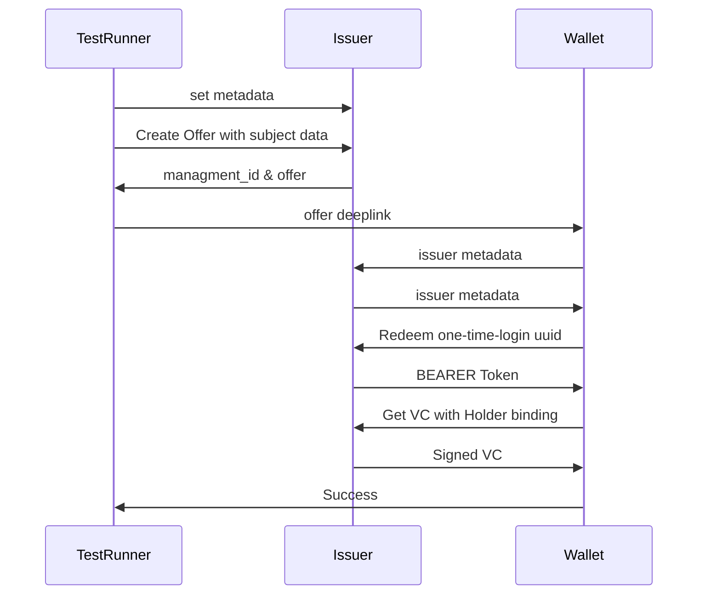
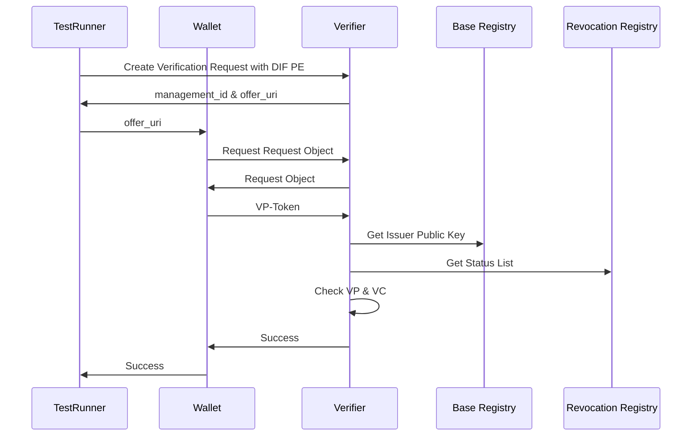
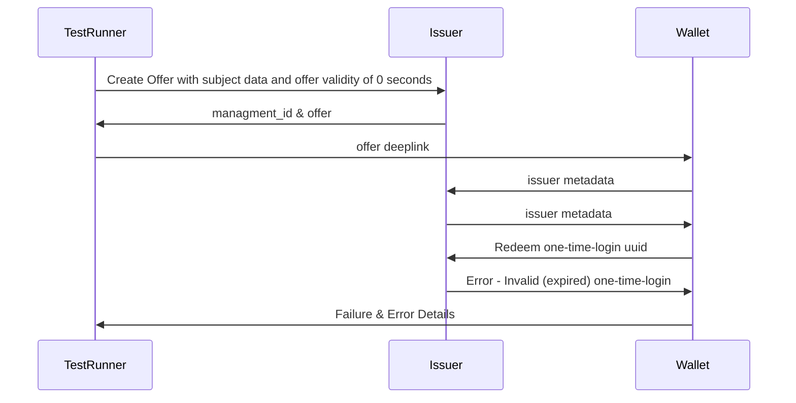
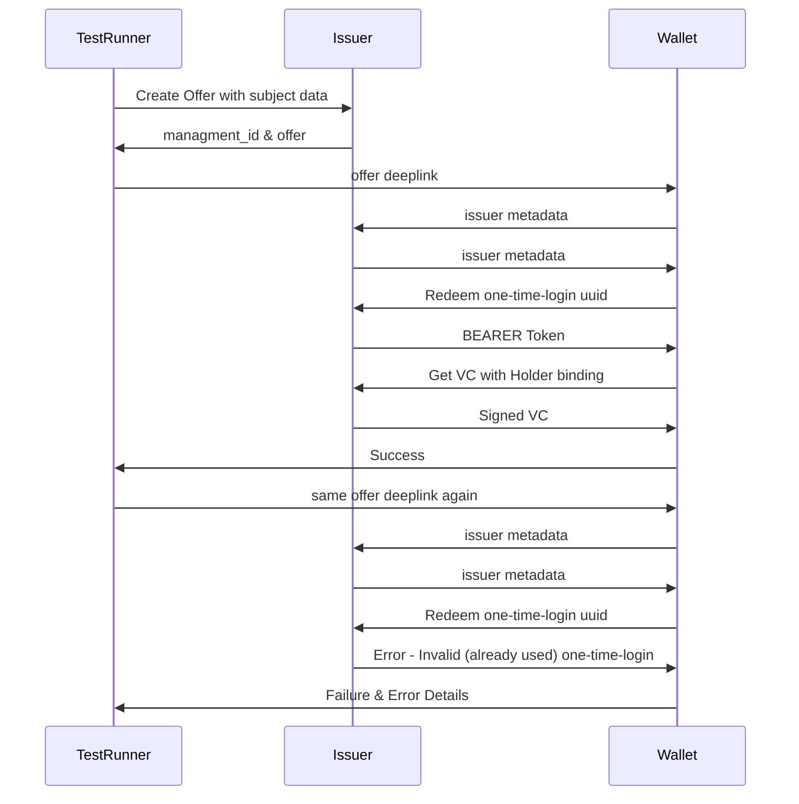
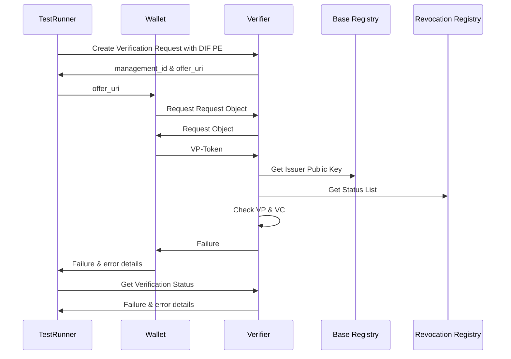
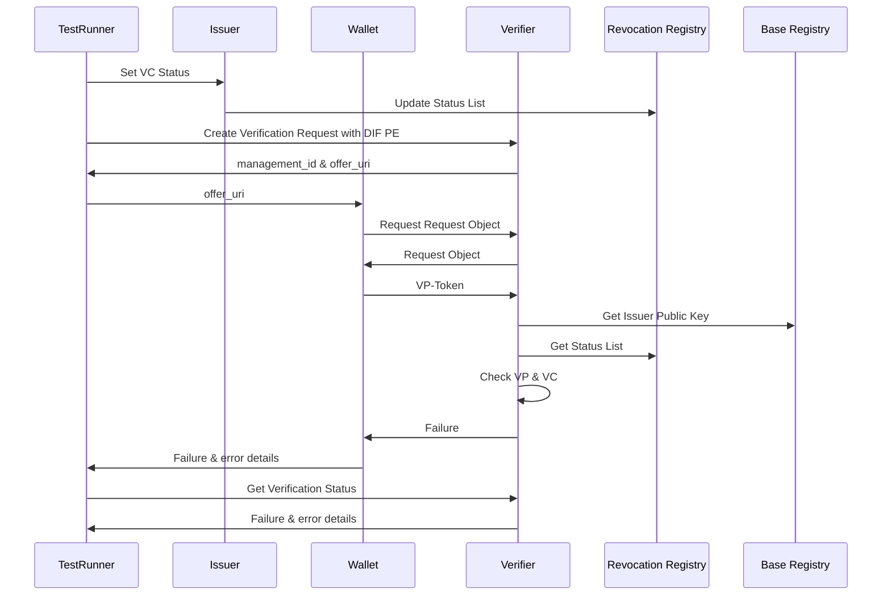

<!--
SPDX-FileCopyrightText: 2024 Swiss Confederation

SPDX-License-Identifier: MIT
-->

# Happy Path Flow core components
## Issuance

## Verification

# Failures tested
## Issuance
For issuance there the only errors that should occure when users are invovled are; the offer is expired or already used.

There are plenty of possible errors in the redeeming process, but these stem from an implementation error on the wallet side.

### Expired Offer `test_expired_offer`
Offer attempting to redeem is expired

### Used Offer `test_used_offer`
Offer has already been redeemed once before

## Verification
### Expired VC `test_expired_vc`
Issuance of expired VC
Attempt to verify it

### Suspended / Revoked VC `test_vc_states`
VC which is suspended / revoked

