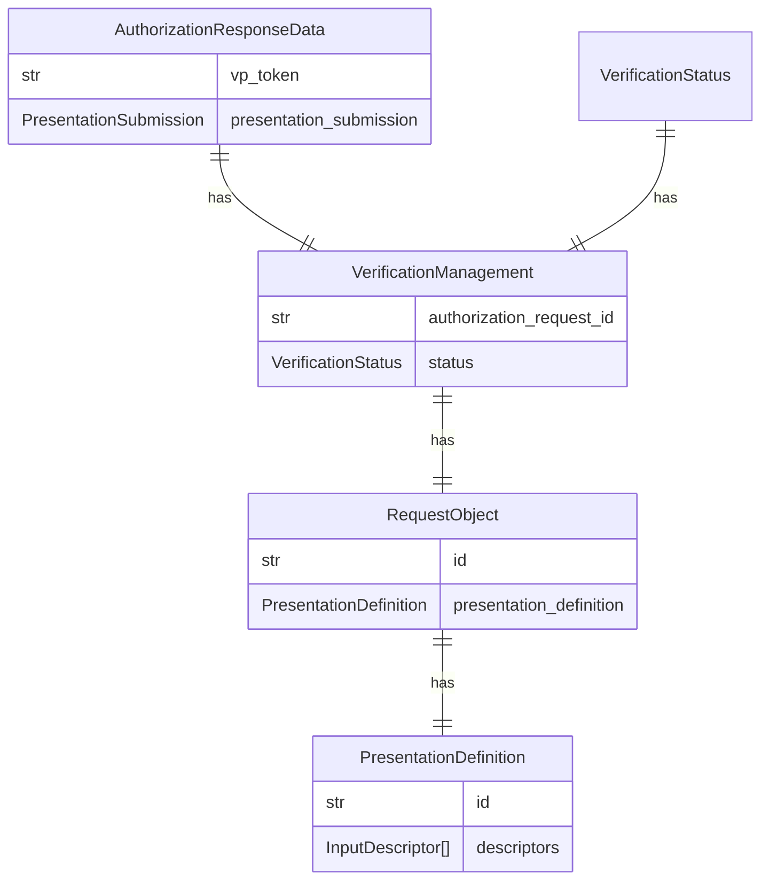
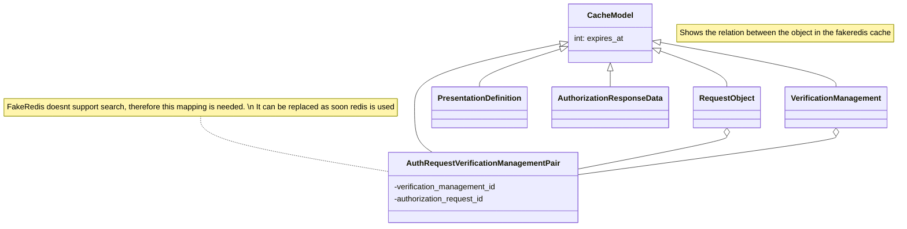

<!--
SPDX-FileCopyrightText: 2024 Swiss Confederation

SPDX-License-Identifier: MIT
-->

# Verifier

The verifier is an entity that requests and verifies verifiable credentials from a holder to confirm their authenticity and validity.

## Implementation details

### Environment Variables
| Variable                     | Description                                                                                                  | Type | Default                                                   |
| ---------------------------- | ------------------------------------------------------------------------------------------------------------ | ---- | --------------------------------------------------------- |
| USE_HTTPS                    | Enables the use of https in all base registry links.                                                         | bool | `True`                                                    |
| ENABLE_DEBUG_MODE            | Enables the debug mode.                                                                                      | bool | `False`                                                   |
| DB_CONNECTION                | Connection string for the database.                                                                          | str  | `postgresql://postgres:mysecretpassword@db_base/registry` |
| APP_NAME                     | Identifier added to the different log entries.                                                               | str  | `Verifier Agent`                                          |
| LOG_LEVEL                    | Log levels according to [logging library](https://docs.python.org/3/library/logging.html#levels)             | str  | `INFO`                                                    |
| ADDITIONAL_ALLOWED_ORIGINS   | Comma separated list of url (e.g. URL,URL,URL) which should be configured as CORs allowed origins parameter. | str  | ``                                                        |
| VERIFICATION_TTL             | Time to live in the internal cache of all data in seconds.                                                   | int  | `86400`  1 day                                            |
| FILTER_ALLOWED_ISSUERS_REGEX | A regex which will be matched against the VCs issuer property.                                               | str  | `.*` Allow All                                            |

### Caching

The verifier doesnt have a permament db. Instead a in memory cache is used. To prevent using too much memory the cache (implemented by the [fakedredis library](https://fakeredis.readthedocs.io/en/latest/redis-commands/Redis/)) removes the key when "expires_at" is reached.

The diagramm below shows the different models which are saved in the cache. For the sake of sinplicity the attributes of the different models aren't displayed

To reduce the complexity a common super class is used which hold the relevant attributes for chaching

